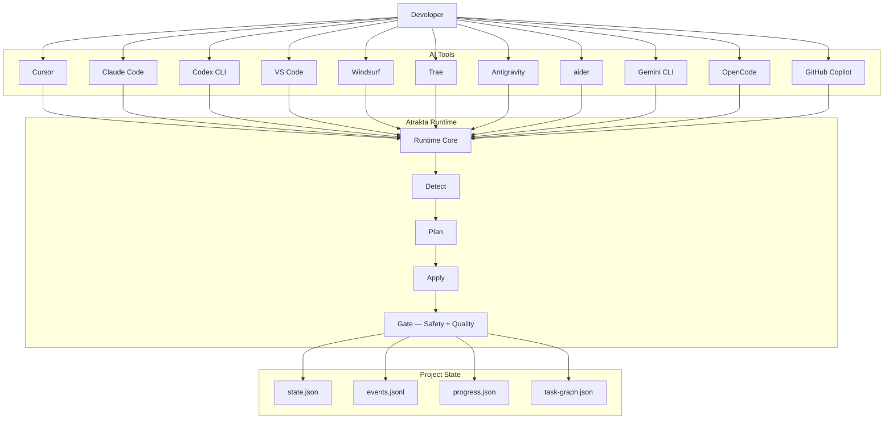

<div align="center">

<picture>
  <source media="(prefers-color-scheme: dark)" srcset="assets/logo-dark.png">
  <source media="(prefers-color-scheme: light)" srcset="assets/logo-light.png">
  
</picture>

# Atrakta

### The missing runtime for AI coding

Switch between **Cursor, Claude Code, Codex, Copilot, VS Code** and
continue the **same AI development session**.

Atrakta makes AI coding:

**Resumable · Reproducible · Tool‑independent**

---

# TL;DR

AI coding tools **do not share session state**.

Switch tools or restart a session and the AI starts from zero.

**Atrakta adds a runtime layer that persists AI development state so any
tool can resume the same workflow.**

Think of it as:

**Git for AI coding sessions.**

---

#  15‑Second Demo

<a href="https://github.com/mash4649/atrakta/releases/latest/download/demo.mp4">
  
</a>

Full resolution: [MP4 (GitHub Release asset)](https://github.com/mash4649/atrakta/releases/latest/download/demo.mp4) · [YouTube](https://youtu.be/42EvSW08GeY)

---

### Without being locked into any AI tool, keep the same development experience anytime.

*An AI development runtime that enables a consistent workflow across any AI coding tool.*

[](go.mod)
[](#quick-start)
[](LICENSE)
[](VERSION)

[English](README.md) · [日本語](README_JA.md)

</div>

---

## Quick Start

**macOS / Linux**

```bash
curl -fsSL https://raw.githubusercontent.com/mash4649/atrakta/main/scripts/build/install.sh | bash
atrakta init --interfaces cursor
```

**Windows** — download `atrakta_*_windows_amd64.zip` from [Releases](https://github.com/mash4649/atrakta/releases):

```powershell
$targetDir = "$env:USERPROFILE\AppData\Local\Programs\atrakta"
New-Item -ItemType Directory -Force $targetDir | Out-Null
Copy-Item .\atrakta.exe "$targetDir\atrakta.exe" -Force
$userPath = [Environment]::GetEnvironmentVariable("Path","User")
if ($userPath -notlike "*$targetDir*") {
  [Environment]::SetEnvironmentVariable("Path", "$userPath;$targetDir", "User")
}
atrakta init --interfaces cursor
```

--

## What is Atrakta?

AI coding tools are multiplying fast.  
Cursor · Claude Code · Codex CLI · VS Code · Windsurf · Trae · Antigravity · aider · Gemini CLI · OpenCode · GitHub Copilot. More every month.

Each tool is powerful. But each has its own workflow, state, and session model.  
Switch tools — or restart a session — and your development continuity breaks.

**Atrakta is a development attractor.**

No matter which AI tool you start with, your development state converges to the same consistent experience.

```
Cursor ──┐
Claude   ├──▶  Atrakta  ──▶  one consistent dev experience
Codex  ──┘
```

> Named after the mathematical concept: an *attractor* is a state that trajectories converge to,  
> regardless of starting point.

---

## The Problem

| Problem | What happens without Atrakta |
|---|---|
| **Tool switching** | Workflow state is lost every time you change tools |
| **Session restart** | AI starts from scratch — no memory of previous decisions |
| **No audit trail** | When automation fails, there's nothing to debug |
| **Risky mutations** | AI may introduce changes you can't track or roll back |

These are not tool-specific bugs. They are **structural gaps** in how AI coding works today.

Atrakta fills them.

---

## How It Works

Atrakta sits between your AI tools and your project state:

```
Cursor  ──┐
Claude   ─┤                          .atrakta/
Codex   ──┼──▶  Atrakta Runtime  ──▶  ├── contract.json   (safety rules)
VS Code ──┤     Detect→Plan→Apply     ├── events.jsonl    (audit log)
aider   ──┘                           ├── state.json      (session state)
                                      └── task-graph.json (work graph)
```

Every AI session becomes **resumable**, **reproducible**, and **auditable** —  
regardless of which tool created it.

---

## Daily Usage

```bash
atrakta start --interfaces cursor   # start a new AI session
atrakta resume                      # continue from where you left off
atrakta doctor                      # diagnose session state
```

`atr` is a built-in short alias:

```bash
atr start --interfaces cursor
atr resume
atr doctor
```

---

## What Gets Created

`atrakta init` creates a project-local state layer:

```
AGENTS.md                     ← instructions for AI agents

.atrakta/
  contract.json               ← safety rules: what AI can and cannot change
  events.jsonl                ← append-only, hash-chained audit log
  state.json                  ← current session state
  progress.json               ← task completion tracking
  task-graph.json             ← DAG of pending / completed work
```

---

## Key Capabilities

### Resumable sessions
Stop mid-task. Switch machines. Come back tomorrow.

```bash
atr resume   # AI picks up exactly where it left off
```

### Deterministic pipeline

```
Detect → Plan → Apply → Gate
```

Atrakta enforces consistent execution order. AI work is predictable and repeatable.

### Append-only event log

```
.atrakta/events.jsonl
```

Every AI action is logged in a hash-chained, append-only format.  
Debug failures. Audit changes. Replay sessions.

### Safety contracts

```json
// .atrakta/contract.json
```

Declarative rules that prevent destructive or unauthorized mutations —  
enforced automatically before any AI change is applied.

---

## Architecture



---

## Ecosystem Position

| Category | Examples | Atrakta |
|---|---|---|
| AI editor | Cursor, VS Code | complements |
| AI CLI | Claude Code, Codex CLI, aider | complements |
| AI workflow framework | LangChain, LangGraph | adjacent |
| AI agent framework | CrewAI, AutoGPT | adjacent |
| **AI development runtime** | *(no established standard)* | **Atrakta** |

---

## Feature Comparison

| Feature | Cursor | Claude Code | **Atrakta** |
|---|:---:|:---:|:---:|:---:|
| Tool-independent sessions | ❌ | ❌ | ✅ |
| Resumable across tools | ❌ | ❌ | ✅ |
| Reproducible runs | ❌ | ⚠️ | ✅ |
| Append-only event log | ❌ | ❌ | ✅ |
| Safety contracts | ❌ | ❌ |✅ |
| Deterministic pipeline | ❌ | ❌ | ✅ |

---

## Troubleshooting

`atrakta: command not found`:

```bash
echo "$PATH" | tr ':' '\n' | grep "$HOME/.local/bin"
ls -l ~/.local/bin/atrakta
```

---

## Documentation

| Topic | Link |
|---|---|
| English docs | [docs/en/README.md](docs/en/README.md) |
| 日本語ドキュメント | [docs/ja/README.md](docs/ja/README.md) |
| Setup guide | [docs/en/03_operations/01_setup.md](docs/en/03_operations/01_setup.md) |
| CLI specification | [docs/en/02_spec/01_cli_spec.md](docs/en/02_spec/01_cli_spec.md) |
| Examples | [examples/README.md](examples/README.md) |
| Changelog | [CHANGELOG.md](CHANGELOG.md) |

---

## Contributing

Contributions are welcome — code, docs, issues, feedback.

See [CONTRIBUTING.md](CONTRIBUTING.md) for how to get started.

If Atrakta resonates with you,  
**⭐ starring the repo** helps others find it.

---

## License

MIT License

Copyright 2026 Shogo Maganuma · See [LICENSE](LICENSE)
