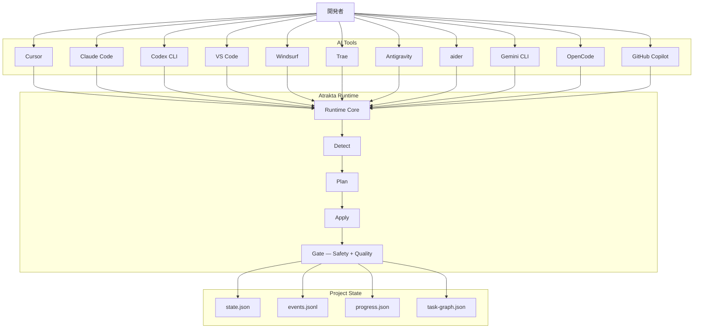

<div align="center">

<picture>
  <source media="(prefers-color-scheme: dark)" srcset="assets/logo-dark.png">
  <source media="(prefers-color-scheme: light)" srcset="assets/logo-light.png">
  
</picture>

# Atrakta

### AIコーディングのための欠けていたランタイム

**Cursor / Claude Code / Codex / Copilot / VS Code**
などのツールを切り替えても、\
**同じAI開発セッションを継続**できます。

AtraktaはAIコーディングを

**再開可能 · 再現可能 · ツール非依存**

にします。

---

# TL;DR

現在のAIコーディングツールは **セッション状態を共有しません。**

ツールを切り替えたりセッションを再起動すると\
AIは **毎回ゼロから開始**します。

Atraktaは **AI開発状態を保存するランタイムレイヤー** を追加し、\
どのツールからでも同じ開発ワークフローを再開できるようにします。

イメージとしては

**AIコーディングセッション版 Git** です。

---

# 15秒で理解するデモ動画

https://github.com/mash4649/atrakta/blob/main/demo/demo.mp4

---

### AIツールに縛られず、いつでも同じ開発体験を。

*あらゆるAIコーディングツールで一貫したワークフローを実現する、AI開発ランタイム。*

[](go.mod)
[](#クイックスタート)
[](LICENSE)
[](VERSION)

[English](README.md) · [日本語](README_JA.md)

</div>

---

## Atrakta とは

AIコーディングツールが急増しています。  
Cursor · Claude Code · Codex CLI · VS Code · Windsurf · Trae · Antigravity · aider · Gemini CLI · OpenCode · GitHub Copilot。毎月新しいものが登場します。

どれも強力ですが、それぞれに独自のワークフロー・状態モデル・セッション管理があります。  
ツールを切り替えたり、セッションを再起動するたびに、開発の継続性が失われます。

**Atrakta は「AIコーディング用ランタイム」です。**

どのAIツールから始めても、開発状態は同じ一貫した体験に収束します。

```
Cursor ──┐
Claude   ├──▶  Atrakta  ──▶  一貫した開発体験
Codex  ──┘
```

> 名前の由来：数学の「アトラクター（attractor）」— 出発点に関わらず、軌道が収束する状態。

---

## 問題

| 問題 | Atrakta なしで起きること |
|---|---|
| **ツール切り替え** | ワークフロー状態がその都度失われる |
| **セッション再起動** | AIがゼロから始める — 前回の判断が引き継がれない |
| **監査証跡なし** | 自動化が失敗してもデバッグの手がかりがない |
| **危険な変更** | AIの変更を追跡・ロールバックできない |

これらはツール固有のバグではありません。  
**今日のAIコーディングの構造的な欠陥です。**

Atrakta はその欠陥を埋めます。

---

## 仕組み

Atrakta は AI ツールとプロジェクト状態の間に入ります：

```
Cursor  ──┐
Claude   ─┤                           .atrakta/
Codex   ──┼──▶  Atrakta Runtime  ──▶  ├── contract.json   （安全ルール）
VS Code ──┤     Detect→Plan→Apply     ├── events.jsonl    （監査ログ）
aider   ──┘                           ├── state.json      （セッション状態）
                                      └── task-graph.json （タスクグラフ）
```

どのツールが作ったセッションでも、**再開可能・再現可能・監査可能**になります。

---

## クイックスタート

**macOS / Linux**

```bash
curl -fsSL https://raw.githubusercontent.com/afwm/Atrakta/main/scripts/install.sh | bash
atrakta init --interfaces cursor
```

**Windows** — [Releases](../../releases) から `atrakta_*_windows_amd64.zip` をダウンロード：

```powershell
$targetDir = "$env:USERPROFILE\AppData\Local\Programs\atrakta"
New-Item -ItemType Directory -Force $targetDir | Out-Null
Copy-Item .\atrakta.exe "$targetDir\atrakta.exe" -Force
$userPath = [Environment]::GetEnvironmentVariable("Path","User")
if ($userPath -notlike "*$targetDir*") {
  [Environment]::SetEnvironmentVariable("Path", "$userPath;$targetDir", "User")
}
atrakta init --interfaces cursor
```

---

## 日常の使い方

```bash
atrakta start --interfaces cursor   # 新しい AI セッションを開始
atrakta resume                      # 前回の続きから再開
atrakta doctor                      # セッション状態を診断
```

`atr` は組み込みの短縮エイリアスです：

```bash
atr start --interfaces cursor
atr resume
atr doctor
```

---

## 初期化で作成されるファイル

`atrakta init` でプロジェクトローカルな状態レイヤーが作成されます：

```
AGENTS.md                     ← AI エージェント向け指示書

.atrakta/
  contract.json               ← 安全ルール：AIが変更して良いもの・いけないもの
  events.jsonl                ← 追記専用ハッシュチェーン監査ログ
  state.json                  ← 現在のセッション状態
  progress.json               ← タスク完了追跡
  task-graph.json             ← 未完了・完了タスクの DAG
```

---

## 主な機能

### セッション復元

作業を中断して、翌日・別マシンで続きから始める。

```bash
atr resume   # AI が止まった場所から正確に再開
```

### 決定論的パイプライン

```
Detect → Plan → Apply → Gate
```

Atrakta が一貫した実行順序を強制します。AI の動作が予測可能で再現可能になります。

### 追記専用イベントログ

```
.atrakta/events.jsonl
```

すべての AI アクションがハッシュチェーン形式で記録されます。  
失敗をデバッグ。変更を監査。セッションを再現。

### セーフティコントラクト

```json
// .atrakta/contract.json
```

破壊的・無許可の変更を防ぐ宣言的ルール。  
AI が変更を適用する前に自動的に検証されます。

---

## アーキテクチャ



---

## エコシステムでの位置づけ

| カテゴリ | 代表例 | Atrakta との関係 |
|---|---|---|
| AI エディタ | Cursor, VS Code | 補完 |
| AI CLI | Claude Code, Codex CLI, aider | 補完 |
| AI ワークフローフレームワーク | LangChain, LangGraph | 隣接 |
| AI エージェントフレームワーク | CrewAI, AutoGPT | 隣接 |
| **AI 開発ランタイム** | *（まだ確立した標準なし）* | **Atrakta** |

---

## 機能比較

| 機能 | Cursor | Claude Code | Atrakta |
|---|:---:|:---:|:---:|
| ツール非依存セッション | ❌ | ❌ | ✅ |
| ツール間再開 | ❌ | ❌ | ✅ |
| 実行再現 | ❌ | ⚠️ | ✅ |
| 監査ログ | ❌ | ❌ | ✅ |
| 安全契約 | ❌ | ❌ | ✅ |
| 決定的パイプライン | ❌ | ❌ | ✅ |

---

## トラブルシュート

`atrakta: command not found` の場合：

```bash
echo "$PATH" | tr ':' '\n' | grep "$HOME/.local/bin"
ls -l ~/.local/bin/atrakta
```

---

## ドキュメント

| 内容 | リンク |
|---|---|
| English docs | [docs/en/README.md](docs/en/README.md) |
| 日本語ドキュメント | [docs/ja/README.md](docs/ja/README.md) |
| セットアップガイド | [docs/ja/03_運用/01_導入手順.md](docs/ja/03_運用/01_導入手順.md) |
| CLI 仕様 | [docs/ja/02_仕様/01_CLI仕様.md](docs/ja/02_仕様/01_CLI仕様.md) |
| 使用例 | [examples/README.md](examples/README.md) |
| 変更履歴 | [CHANGELOG.md](CHANGELOG.md) |

---

## コントリビューション

コード・ドキュメント・Issue・フィードバック、どんな形でも歓迎です。

参加方法は [CONTRIBUTING.md](CONTRIBUTING.md) を参照してください。

Atrakta のコンセプトが響いたら、  
**⭐ Star をお願いします** — プロジェクトの認知度向上に直結します。

---

## ライセンス

MIT License

Copyright 2026 Shogo Maganuma · 詳細は [LICENSE](LICENSE)
